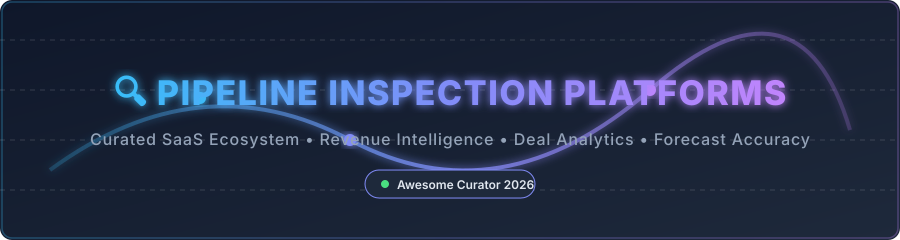

# 🔍 Awesome Pipeline Inspection Platform & Revenue Intelligence Ecosystem 🚀



<p center>
<a href="https://github.com/ishandutta2007/Awesome-Awesome-Awesome"></a><a href="https://discord.gg/jc4xtF58Ve"></a>
<a href="https://github.com/ishandutta2007/Awesome-Pipeline-Inspection-Platform"></a>
<a href="https://github.com/ishandutta2007/Awesome-Pipeline-Inspection-Platform/fork"></a>
<a href="https://github.com/ishandutta2007"></a>
</p>

## 📌 Top Pipeline Inspection Platforms Ecosystem

**Curated List of SaaS Products & Open-Source GitHub Projects** 📊

*Focused on Sales Pipeline Visibility, Deal Inspection, Revenue Forecasting, Conversation Intelligence, Revenue Operations (RevOps) & Forecast Accuracy* 🎯

**Last updated: September 2026** 📅

---

### 💡 Overview & Market Dynamics

This repository tracks notable **SaaS platforms** and **open-source projects** for **Pipeline Inspection** and **Revenue Intelligence**. These tools help go-to-market (GTM) teams inspect deals, improve forecast accuracy, surface win/loss risks, and gain visibility into pipeline health—often by combining CRM opportunity data, sales activity signals, and conversation intelligence. 📈

> 📊 **Market Size & Sector Structure**: The global Revenue Intelligence & Pipeline Inspection software market size is estimated at **$2.5B–$3.5B in 2026** (projected to reach **$8B+ by 2032** at ~15% CAGR). The market is **moderately fragmented** with enterprise market consolidation around category titans like Gong and Clari, while specialized AI agents (e.g. Attention, Scratchpad) rapidly capture mid-market market share.

---

## 📑 Table of Contents

- [🏢 SaaS/Hosted Platforms](#-saashosted-platforms)
- [🔓 Open-Source GitHub Projects](#-open-source-github-projects)
- [🤝 How to Contribute](#-how-to-contribute)
- [💖 Support & Sponsorship](#-support--sponsorship)
- [⚠️ Disclaimer](#-disclaimer)
- [📈 Star History](#-star-history)

---

## 🏢 SaaS/Hosted Platforms

SaaS pipeline inspection solutions offer turnkey CRM synchronization, AI-guided deal risk detection, and automated sales activity capture. Below is the curated list sorted by **Company Size / Valuation / Revenue (descending)**:

| Product | Description | Company Size / Valuation / Revenue | Starting Tier Price | Free Tier / Free Trial Limits |
| :--- | :--- | :--- | :--- | :--- |
| 🦣 **[Gong](https://www.gong.io/)** | Category-defining conversation intelligence & revenue platform analyzing calls/emails for pipeline health. | **$500M+ ARR** / ~$4.5B–$7.25B Valuation (Large Enterprise) | Sales-led custom quote (~$1,000 - $1,600 / user / year + base platform fee) | No public free trial; sales-managed pilots (14–30 days) available on request. |
| 🎯 **[Clari](https://www.clari.com/)** | Enterprise revenue platform focused on predictive forecasting, pipeline inspection, and revenue leakage prevention. | **~$450M ARR** / $2.6B Valuation (Enterprise) | Sales-led custom quote (~$100 - $120 / user / month estimated entry) | No free tier; custom evaluation demo available on request. |
| 🤖 **[People.ai](https://www.people.ai/)** | Revenue intelligence engine capturing activity data & engagement metrics to guide pipeline management. | **~$63M–$78M ARR** / $1.1B Valuation (Unicorn) | Sales-led custom quote (~$50 - $100 / user / month estimated entry) | No free tier; sales demo / pilot available on request. |
| ⚡ **[Attention](https://www.attention.com/)** | AI-native revenue platform combining automated call summaries, CRM updates, and real-time deal risk tracking. | **~$11.6M ARR** / ~$100M–$300M Valuation ($30M Series B) | Sales-led custom quote (~$99 / user / month estimated entry) | No free tier; live demo and custom pilot on request. |
| 📈 **[BoostUp](https://www.boostup.ai/)** | Revenue intelligence and forecasting platform providing deal risk scoring and pipeline coverage analysis. | **~$10.8M ARR** / VC-backed Mid-Market | Sales-led custom quote (~$79 / user / month estimated entry) | No free tier; custom demo available on request. |
| ⌨️ **[Scratchpad](https://www.scratchpad.com/)** | Fast sales workspace and pipeline inspection interface for Salesforce reps and RevOps managers. | **~$10.1M ARR** / VC-backed (Series B) | $19 / user / month (Solo plan) | **Free forever plan** available (limited to 3 workspace views, 100 AI credits/user/month, 10 hrs call recording/month). |
| 🧠 **[Salesken](https://www.salesken.ai/)** | AI conversation intelligence & sales coaching platform providing pipeline insights and real-time playbook assistance. | **~$17.9M ARR** / $95M Valuation | $99 / user / month (Base recorded user tier + platform fee) | No permanent free tier; proof-of-concept / trial available via sales contact. |
| 📊 **[Revenue Grid](https://www.revenuegrid.com/)** | Revenue intelligence suite offering automated activity capture, pipeline visibility, and guided selling. | **~$15M–$25M Revenue** / Growth-stage | $30 / user / month (Activity Capture 360 plan) | **14-day full-featured free trial** available. |
| 📱 **[Veloxy](https://www.veloxy.com/)** | Mobile-first sales acceleration and pipeline management solution for field and inside sales teams. | **~$5.7M ARR** / Growth-stage | $25 / user / month (Lite plan) | **14-day free trial** (full-featured, time-limited). |
| 📹 **[Salesroom](https://www.salesroom.com/)** | Live video meeting platform built specifically for sales reps with integrated real-time pipeline notes and intelligence. | Early-stage VC-backed | $29 / user / month (Standard plan) | No public free plan; demo and trial on request. |

---

## 🔓 Open-Source GitHub Projects

Open-source options allow RevOps teams, data engineers, and ML researchers to build self-hosted CRM pipelines, custom deal scoring models, and time-series sales forecasting algorithms. Below is the list sorted by **GitHub_Stars (descending)**:

- 🛠️ **[Twenty](https://github.com/TwentyHQ/twenty)** [](https://github.com/TwentyHQ/twenty/stargazers)  
  Modern open-source CRM platform providing full pipeline Kanban boards, opportunity management, custom fields, and customizable workflow automations.

- 🧮 **[SHAP](https://github.com/shap/shap)** [](https://github.com/shap/shap/stargazers)  
  Game-theoretic approach (SHapley Additive exPlanations) used by RevOps data teams for explainable AI deal scoring and pipeline stage conversion modeling.

- 🔮 **[Prophet](https://github.com/facebook/prophet)** [](https://github.com/facebook/prophet/stargazers)  
  Automatic time-series forecasting procedure by Meta, widely used for predicting monthly/quarterly sales pipeline volume and revenue trends.

- 📊 **[Kats](https://github.com/facebookresearch/Kats)** [](https://github.com/facebookresearch/Kats/stargazers)  
  Meta's lightweight library for time-series analysis, forecasting sales metrics, detecting pipeline anomalies, and predicting revenue drift.

- 🦁 **[Merlion](https://github.com/Salesforce/merlion)** [](https://github.com/Salesforce/merlion/stargazers)  
  Salesforce's Python framework for time series intelligence, offering automated anomaly detection and forecasting tailored for enterprise CRM datasets.

- 🌌 **[NeuralProphet](https://github.com/ourownstory/neural_prophet)** [](https://github.com/ourownstory/neural_prophet/stargazers)  
  PyTorch-based neural time-series forecasting model combining traditional additive decomposition with deep learning for complex sales funnel predictions.

- 📋 **[Frappe CRM](https://github.com/frappe/crm)** [](https://github.com/frappe/crm/stargazers)  
  Modern, open-source lead & deal management software built on the Frappe framework with pipeline stage tracking and sales analytics.

- 🔌 **[Simple Salesforce](https://github.com/simple-salesforce/simple-salesforce)** [](https://github.com/simple-salesforce/simple-salesforce/stargazers)  
  A basic, clean REST API client for Salesforce used to extract pipeline opportunity records and sync activity logs into custom analytics data warehouses.

- 🟧 **[HubSpot API Python Client](https://github.com/hubspot/hubspot-api-python)** [](https://github.com/hubspot/hubspot-api-python/stargazers)  
  Official Python v3 SDK for HubSpot APIs to query deal stages, pipeline changes, and sales activities for custom inspection workflows.

- 🚀 **[Sales Forecast MLOps at Scale](https://github.com/jomariya23156/sales-forecast-mlops-at-scale)** [](https://github.com/jomariya23156/sales-forecast-mlops-at-scale/stargazers)  
  Production-ready open architecture demonstrating real-time sales forecasting with Kafka, Ray/Spark ML retraining, and Grafana pipeline dashboards.

---

### 🧩 Open-Source Architecture Frameworks

Revenue operations and data science teams building custom pipeline inspection engines typically combine open-source modules as follows:

```
Extract CRM Deals (Simple Salesforce / HubSpot SDK) 
  ➔ Feature Store & Activity Capture 
  ➔ ML Deal Risk Scoring (SHAP / Scikit-Learn) 
  ➔ Revenue Time-Series Forecast (Prophet / Merlion) 
  ➔ Pipeline Visualization Dashboard (Twenty / Frappe CRM)
```

---

## 🤝 How to Contribute

Contributions are always welcome! 🌟

1. 🍴 Fork the repository.
2. 📝 Add or edit entries in `README.md` maintaining the existing Markdown table / list format.
3. 🔗 Ensure all SaaS and open-source project links are official and working.
4. 📥 Submit a Pull Request (PR) with a short description of your changes.

---

## 💖 Support & Sponsorship

If you find this curated ecosystem list helpful for your RevOps strategy or engineering project, please consider supporting the project! ⭐

- 🌟 **Star this repository** on GitHub to increase visibility.
- 🔀 **Fork this repository** to customize your own team list.
- 📢 **Share it** with your RevOps, CRO, and engineering colleagues!
- ☕ **Buy a coffee / Sponsor**: Support ongoing maintenance via [GitHub Sponsors](https://github.com/sponsors/ishandutta2007).

---

## ⚠️ Disclaimer

- This repository is a **community-curated index** — provided for informational and research purposes only.
- Pipeline inspection and deal forecasting platforms handle sensitive customer and sales pipeline data. Ensure proper data governance, privacy compliance (GDPR/CCPA), and CRM security.
- Forecasts generated by any software are estimates only.

---

## 📈 Star History

[](https://star-history.dera.page/#ishandutta2007/Awesome-Pipeline-Inspection-Platform&type=date&legend=top-left)

---

<p align="center">
  <b>Made with ❤️ for CROs, RevOps leaders, Sales Managers, and Revenue Engineers seeking complete pipeline visibility.</b>
</p>
